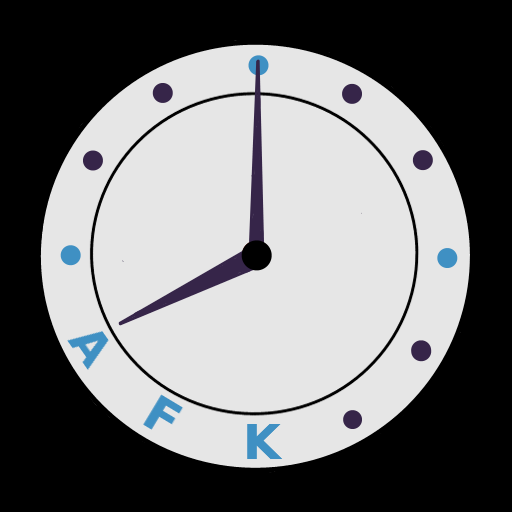

  

# AFKy bot
 Away From Keyboard (for a) year is a discord bot that notifies user that they have been away for a year.
 I might add option to set durration but for now a year it is.

 # Why not ... ?
 1. mongodb - fuck that shit
 2. Use unwrap - do you want your bot to panic everytime there is an issue?
 3. NOT use unrap - idk this shit confusing
 4. use js - fuck u i want rust

 # Who created that logo?
 My sister, and I like it, you don't have to.